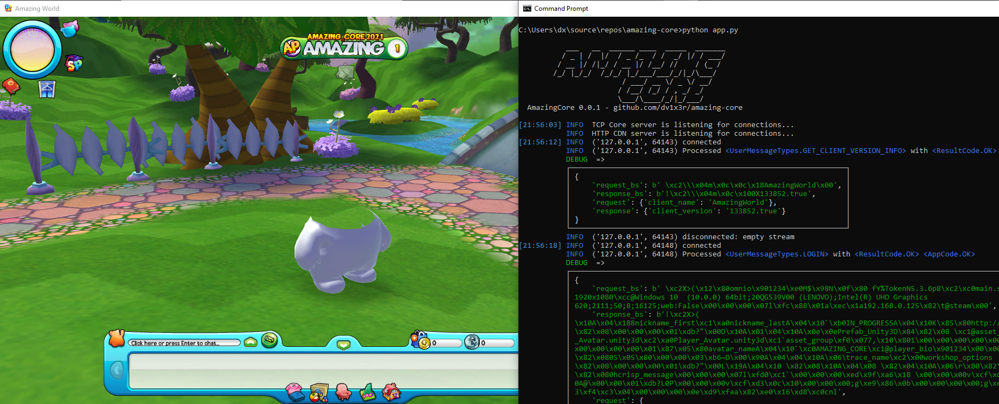

# Amazing Core


Here we will try to create a custom server for the Amazing World game, which was closed in 2018.

- Game page on Steam: https://steamcommunity.com/app/293500
- Download game with Steam: steam://install/293500
- Discord Server: https://discord.gg/TWfTBbfdA9
- See what is implemented in [GitHub Releases](https://github.com/dv1x3r/amazing-core/releases) and [GitHub Projects](https://github.com/dv1x3r/amazing-core/projects)

<br> <br>

## Looks like this



## How to Run

1. Download and install [python 3.9+](https://www.python.org/downloads/) using a big yellow button (use installer defaults)
2. Install the game with Steam: paste this link into your browser - steam://install/293500
3. Remove (or rename) : ```steam_api.dll```, ```steam_appid.txt``` and ```SteamworksNative.dll``` in the game folder, otherwise Steam will count hours in game
4. Edit ServerConfig.xml in the game folder: ```ServerIP = 'localhost'```
5. Download the latest Amazing Core [release](https://github.com/dv1x3r/amazing-core/releases)
6. Shift + Right click on the Amazing Core folder -> Open PowerShell / Open Command Prompt
7. Run the following command to install python libraries
   ```
   pip install -r .\requirements.txt
   ```
8. Run the following command to start Amazing Core server
   ```
   python app.py
   ```
9. Start the Game

<br>

## Contributing

We are happy to any kind of support!

- Join us on [Discord](https://discord.gg/TWfTBbfdA9) to dive into the Legacy World together and share some datamining insights!
- Explore our technical documentation [here](docs/documentation.md) to better understand how Amazing World / Core works.
